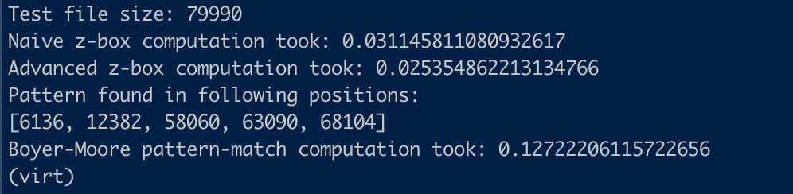
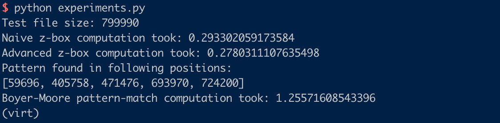
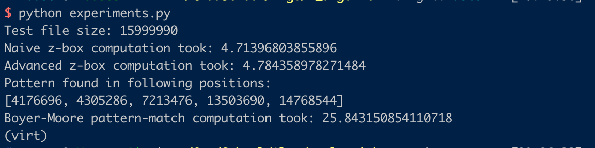

# Experiments 

### Usage
Using Z Algorithm Implementation

For simple, configurable experiments, user the `experiments.py` script, which can be run:
```
python experiments.py <PATTERN> <TEXT>
```

For larger experiments, use the `file_test_experiments.py` script, which will generate a file with a user-specified number of repetitions of the work 'haystack' with the word 'needle' sprinkled through at random positions. After generating the text file, the script will then run the z algorithm on the generated text searching for the pattern 'needle'. These experiments can be run with:

```
python file_test_experiments.py 
```

********************

### Results

*Small file experiments*
Generate a file with 10,000 iterations of the word 'haystack' and 5 iterations of the word 'needle'



*Medium file experiments*
Generate a file with 100,000 iterations of the word 'haystack' and 5 iterations of the word 'needle'


*Large file experiments*
Generate a file with 2,000,000 iterations of the word 'haystack' and 5 iterations of the word 'needle'


